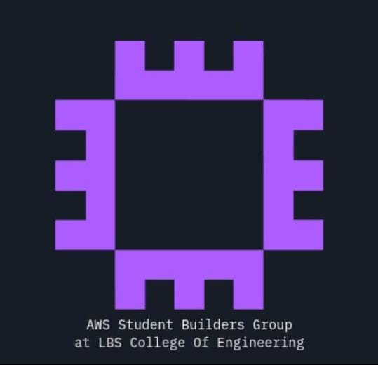

<table>
  <tr>
    <td width="50%" align="left">
      
    </td>
    <td width="50%" align="right">
      
    </td>
  </tr>
</table>

# Everything You Need to Know About AWS Student Builder Groups (AWS SBG)

Myself, **Fathima Rasha** ([LinkedIn](https://www.linkedin.com/in/fathima-rasha-2a35b5319)). I founded the first AWS Cloud Club from Kerala and became the first and only Cloud Captain from Kerala, so it is my responsibility to invite and help other students to build SBGs in their colleges too.

Formerly known as **AWS Cloud Clubs**, AWS SBG has now been rebranded as **AWS Student Builder Groups**. Its focus has also become broader, covering areas such as **AI, Cloud, and Development (including Full-Stack Development)**.

And yes—this article is for you even if you've never been into cloud computing before.

---

## First of All, What Is AWS?

**AWS (Amazon Web Services)** is a cloud service provider. Unlike many other providers, AWS has become one of the most widely used and dominant platforms in the cloud industry.

One thing I really like about AWS is how much it encourages community growth. It has different community programs for different groups of people:

- **AWS User Groups** – Led by professionals.
- **AWS Student Builder Groups (AWS SBG)** – Led by campus students.

Altogether, these programs help expand the AWS community at the regional level and beyond.

---

## Now, Coming to AWS Student Builder Groups (AWS SBG)

AWS Student Builder Groups, formerly known as **AWS Cloud Clubs**, are student communities similar to other technical clubs in your college.

If your campus doesn't have an AWS SBG yet, you can take the initiative and apply to start one.

## How Does the Process Work?

### 1. Apply for AWS SBG

If you get selected, AWS will onboard you into their new cohort.

### 2. Onboarding Email

After selection, you'll receive emails regarding onboarding and the next steps.

### 3. Never Miss the Onboarding Call

This is one of the most important parts of the program.

During the onboarding call, the AWS team will explain the entire program, expectations, and everything you need to know.

### 4. You'll Get a Dedicated 1:1 Account Manager

An Account Manager will be assigned to guide you throughout your journey.

You can reach out to them anytime if you have questions or need help. Trust me—they're super helpful.

### 5. Monthly Meetings

There will be monthly meetings where all AWS SBG Leaders and the AWS SBG team come together to share:

- Updates
- Announcements
- Opportunities
- Other important information

Make sure you follow along with them.

---

## What Do You Have to Do as an SBG Leader?

Once you get selected, the first thing you should do is **build a strong core team**.

This is really important because some may help during the initial phase, but later they may not be able to continue supporting your AWS SBG.

So, make sure you choose people who are willing to stay with your SBG throughout.

Once you've built your core team, start expanding your community across your campus and beyond.

For reference, I will share what I did.

## Here's What I Did

- Conducted **class-wise campaigns** to introduce students to our AWS SBG.
- Encouraged students to join **AWS Builder Center**, where AWS experts, AWS employees, and the community regularly share updates, articles, learning resources, and opportunities.
- Organized an **introductory event**.
- Conducted **workshops and technical sessions**.
- **Always host your events on Meetup.** This is an important one—I initially missed it, so don't make the same mistake.
- Started an **AWS certification series** to help students begin their cloud journey and become skilled AWS professionals.

The goal is simple:

> **Build a huge, meaningful, impactful, and outstanding student community in your college.**

---

## What Do You and Your Community Gain?

### As a Leader, You'll Gain

- Leadership skills
- Event management skills
- Communication and teamwork
- Networking opportunities

### Your Community Will Gain

- Support from AWS
- Exposure to the AWS ecosystem
- Hands-on cloud learning
- Valuable connections with AWS employees, community leaders, and students worldwide
- Regular AWS updates, learning resources, and opportunities

---

## Final Thoughts

I had covered everything about **AWS Student Builder Groups**.

If you have any questions, feel free to reach out. I'm always happy to help.

**All the best!**

If your campus doesn't have an AWS Student Builder Group yet, **take the initiative and start one.**

Join the AWS ecosystem—I truly believe it can completely change you and your community.

---

For any doubts, you can reach out to me:
[LinkedIn](https://www.linkedin.com/in/fathima-rasha-2a35b5319)

